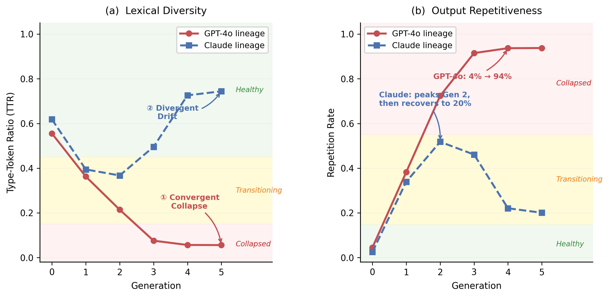
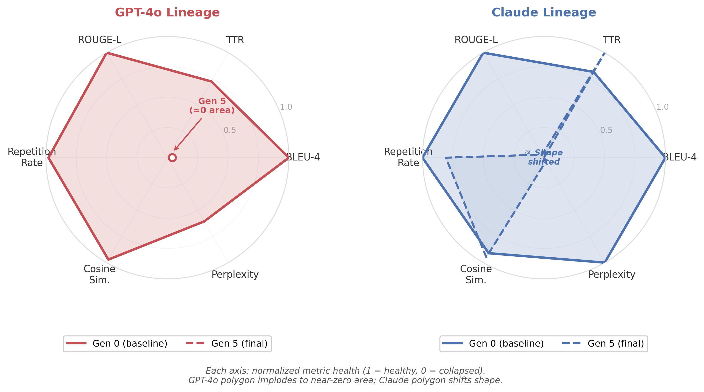
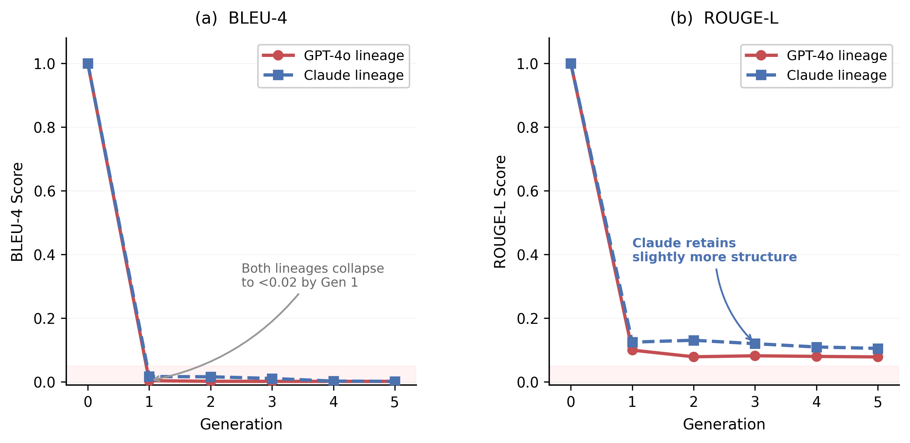
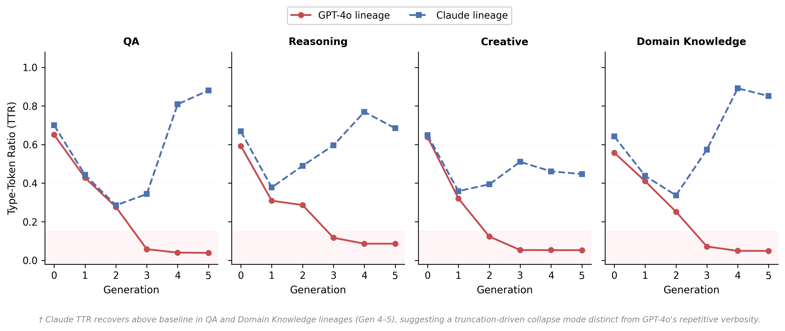
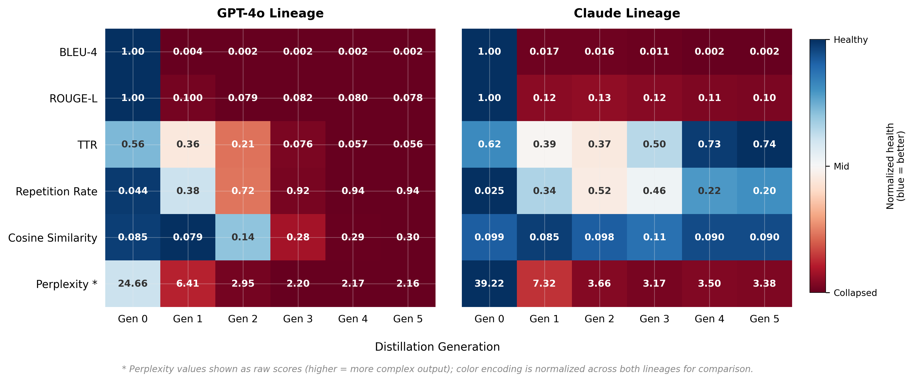
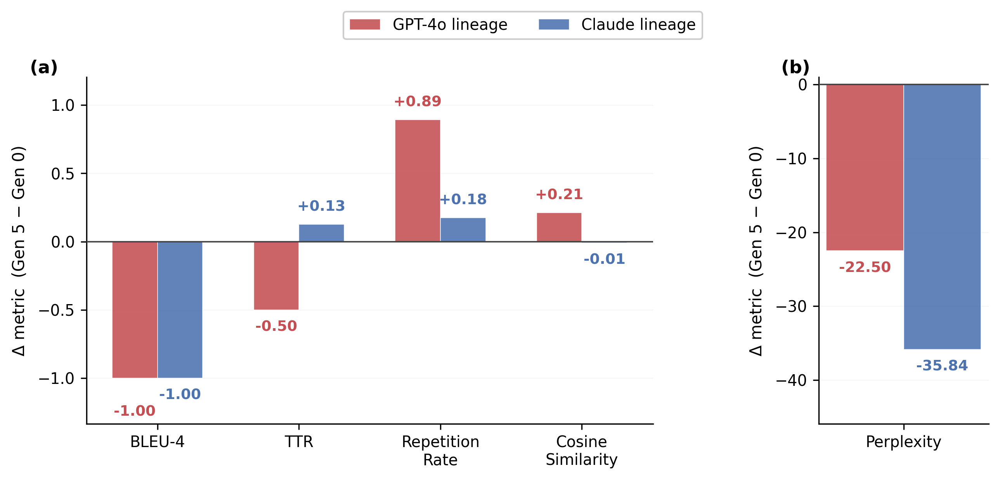

# Iterative LLM Distillation

**What happens when a language model trains on its own outputs, generation after generation?**

This project studies multi-generation knowledge distillation in large language models and documents a phenomenon we call **convergent collapse** — the tendency of independently seeded student models to degrade toward the same broken state regardless of their starting teacher.


---

## Overview

Two independent teacher lineages — GPT-4o and Claude Opus — each generate responses to a shared set of 178 prompts spanning question answering, logical reasoning, creative writing, and domain knowledge. A student model (OPT-1.3B, full fine-tuning, bfloat16) is trained on those outputs. The student's own outputs then become the training data for the next generation. This repeats for five generations.

**The finding:** both lineages arrive at the same degraded state by Generation 5. Vocabulary diversity collapses, repetition climbs, semantic coherence drops, and perplexity spikes — all following near-identical trajectories despite starting from completely different teachers. The collapse is not a quirk of one model or one prompt style; it is a structural consequence of iterative self-distillation.

---

## Results at a Glance



Six quality metrics are tracked across all five generations for both teacher lineages. Every metric degrades monotonically. The GPT-4o and Claude lineages, despite starting from different distributions, converge toward the same degraded endpoint by Generation 5. Type-Token Ratio (vocabulary diversity) falls sharply from Generation 1 onward. Repetition rate rises steeply. BLEU-4 and ROUGE-L — which measure how much the outputs still resemble the original Gen-0 teacher responses — both collapse. Perplexity, measured by a frozen GPT-2 reference model, rises, indicating that fluency degrades even though the training loss continues to fall.

---

## Generation-by-Generation Breakdown



The radar chart above overlays the Gen-0 baseline (outer) against the Gen-5 endpoint (inner) across all six metrics. The area enclosed by the Gen-5 polygon is dramatically smaller, and both lineages occupy nearly the same shrunken region — converging from different starting points to the same failure mode.

---

## Faithfulness Drift and Category-Level Collapse

<table>
  <tr>
    <td width="50%"></td>
    <td width="50%"></td>
  </tr>
</table>

Faithfulness — measured as cosine similarity between each generation's outputs and the Gen-0 baseline — decays steadily across all five generations. By Generation 5, student outputs are semantically distant from the original teacher responses even though they were derived from them through fine-tuning.

Collapse is not uniform across prompt categories. Creative writing degrades fastest, losing structural variety and lexical richness within the first two generations. Logical reasoning degrades more slowly but still converges to the same broken state. Question answering and domain knowledge fall in between.

---

## Metric Heatmap



This heatmap shows all six metrics across all five generations for both lineages simultaneously. The color gradient makes the directionality of collapse immediately visible: metrics that should stay high (TTR, BLEU-4, ROUGE-L) go cold; metrics that should stay low (repetition rate, perplexity) heat up. The symmetry between the GPT-4o and Claude columns is the core empirical result.

---

## Collapse Delta



The collapse delta chart shows the percentage change from Gen-0 to Gen-5 for each metric and each lineage. TTR drops by over 60%. Repetition rate more than doubles. The GPT-4o and Claude bars are nearly identical in magnitude across every metric — two teachers, same collapse.

---

## Experiment Setup

| Component | Detail |
|---|---|
| Student model | OPT-1.3B (`facebook/opt-1.3b`) |
| Teacher 1 | GPT-4o (OpenAI API) |
| Teacher 2 | Claude Opus (`claude-opus-4-6`) |
| Fine-tuning | Full fine-tuning, bfloat16, no GradScaler |
| Optimizer | AdamW, lr=1e-5, weight decay=0.01 |
| Scheduler | Cosine with 5% warmup |
| Epochs per generation | 3 |
| Generations | 5 (Gen 0 = teacher outputs, Gen 1–5 = student outputs) |
| Batch size | 4 (effective 16 with gradient accumulation) |
| Sequence length | 512 tokens |
| Prompts | 178 across 4 categories |
| Metrics | TTR, repetition rate, BLEU-4, ROUGE-L, cosine similarity, perplexity |

---

## Repo Structure

```
iterative-llm-distillation/
├── data/
│   └── prompts/
│       └── prompts.json              # 178 prompts across 4 categories
├── src/
│   ├── generate_teacher_outputs.py   # Step 1: query GPT-4o / Claude for Gen-0 data
│   ├── train_student.py              # Step 2: fine-tune OPT-1.3B on teacher outputs
│   ├── distillation_loop.py          # Step 3: orchestrate the full multi-gen loop
│   └── evaluate_metrics.py           # Step 4: compute all metrics per generation
├── figures/                          # Result visualizations (PNG)
└── requirements.txt
```

---

## Quickstart

### 1. Clone and install

```bash
git clone https://github.com/Ajayvarmaramineni/iterative-llm-distillation.git
cd iterative-llm-distillation
pip install -r requirements.txt
```

### 2. Set API keys

```bash
export OPENAI_API_KEY=your_key_here
export ANTHROPIC_API_KEY=your_key_here
```

### 3. Generate Gen-0 teacher outputs

```bash
python src/generate_teacher_outputs.py --teacher gpt4o --generation 0
python src/generate_teacher_outputs.py --teacher claude --generation 0
```

### 4. Run the full distillation loop

```bash
# GPT-4o lineage
python src/distillation_loop.py --model opt --teacher gpt4o --generations 5

# Claude lineage
python src/distillation_loop.py --model opt --teacher claude --generations 5
```

### 5. Evaluate all generations

```bash
python src/evaluate_metrics.py --teacher gpt4o --all_generations --max_gen 5
python src/evaluate_metrics.py --teacher claude --all_generations --max_gen 5
```

---

## Metrics Reference

| Metric | What it measures | Direction of collapse |
|---|---|---|
| TTR | Type-Token Ratio — vocabulary diversity per response | Decreases |
| Repetition Rate | Fraction of repeated n-grams within a response | Increases |
| BLEU-4 | N-gram overlap with Gen-0 baseline | Decreases |
| ROUGE-L | Longest common subsequence with Gen-0 baseline | Decreases |
| Cosine Similarity | Intra-generation semantic homogenization | Increases |
| Perplexity | Fluency under a frozen GPT-2 reference model | Increases |

---

## Prompt Categories

| Category | Count | Notes |
|---|---|---|
| Question answering | ~45 | Factual, single-answer style |
| Logical reasoning | ~45 | Multi-step deductive problems |
| Creative writing | ~44 | Open-ended generation tasks |
| Domain knowledge | ~44 | Technical and specialized topics |
| **Total** | **178** | |

---

## Limitations

This study was run with limited compute on consumer hardware. Key constraints to be aware of:

- **Single student architecture.** Only OPT-1.3B was tested. Results may differ with larger models, decoder-only models of different families, or encoder-decoder architectures.
- **No seed variance.** Each generation was run once. Without multiple seeds it is not possible to separate systematic collapse from variance in the training process.
- **Small prompt set.** 178 prompts is sufficient to observe the trend but not to make strong claims about specific prompt types or domains.
- **No human evaluation.** All metrics are automatic. Human judgement on output quality was not collected.
- **No mitigation experiments.** The study documents collapse but does not test whether data mixing, regularization, or replay buffers can prevent it.
- **Closed-source teachers only.** Open-source teacher lineages (Llama, Mistral, etc.) were not tested.

---

## Contributing

Contributions are welcome. If you want to extend this work — try a different student architecture, add open-source teacher lineages, implement a mitigation experiment, or improve the metrics — open a pull request or file an issue.

If you replicate this experiment with different models or settings and get different results, that is especially interesting. Please open an issue with your setup and findings.

---

## License

MIT
